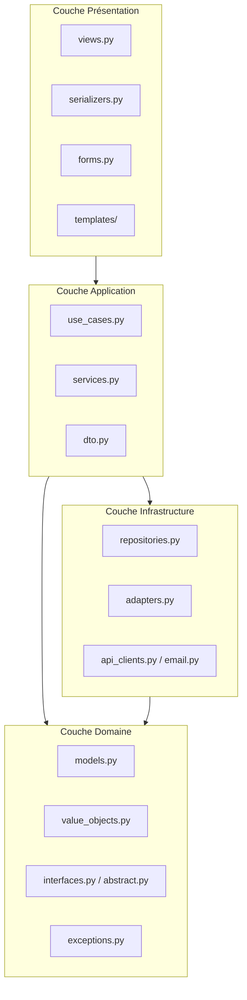
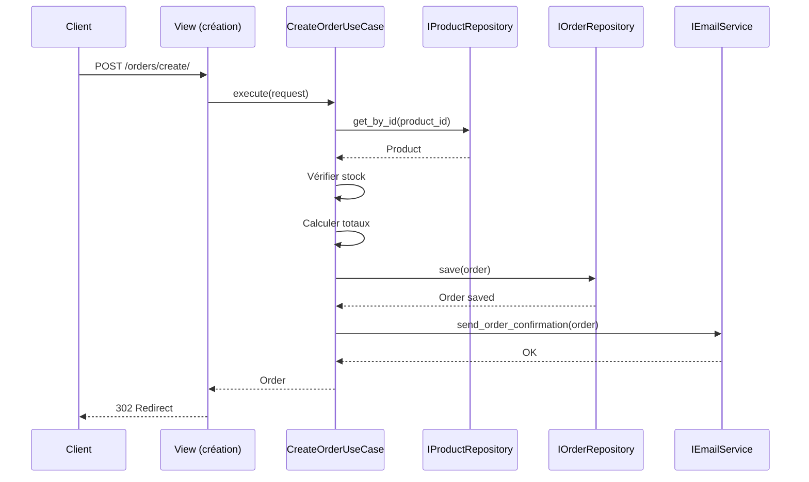
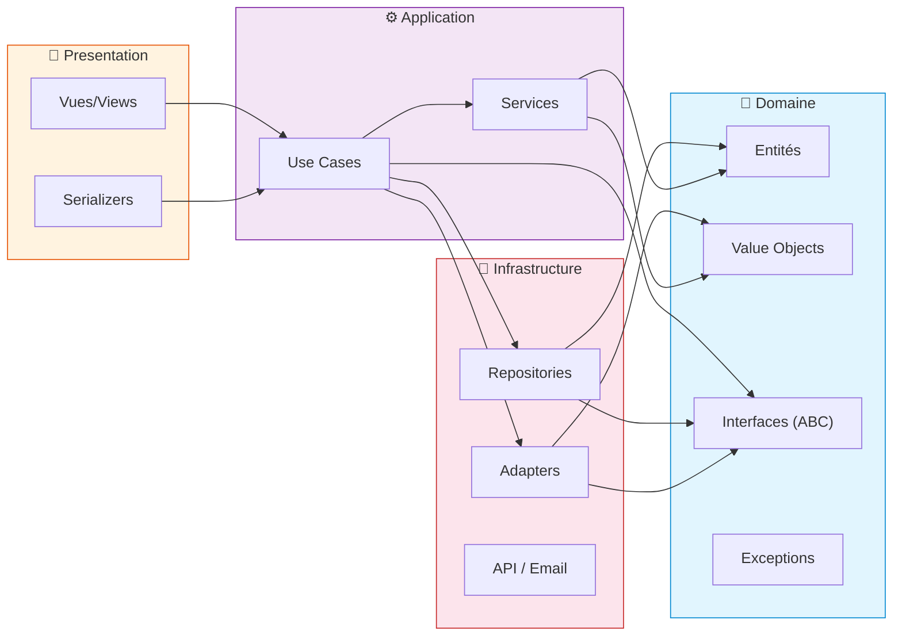

# Django SOLID Architecture Skill

> Architecture modulaire, maintenable et testable pour projets Django
> Python 3.12+ · Django 5+ · Typage strict · Principes SOLID

---

## Table des matières

1. [Vue d'ensemble de l'architecture](#1-vue-densemble-de-larchitecture)
2. [Implémentation des principes SOLID](#2-implémentation-des-principes-solid)
3. [Patterns recommandés](#3-patterns-recommandés)
4. [Exemple concret : Gestion de commandes e-commerce](#4-exemple-concret--gestion-de-commandes-e-commerce)
5. [Anti-patterns à éviter](#5-anti-patterns-à-éviter)
6. [Testing](#6-testing)
7. [Conventions de code](#7-conventions-de-code)
8. [Bonus](#8-bonus)

---

## 1. Vue d'ensemble de l'architecture

### Diagramme des couches



### Rôle de chaque couche

| Couche | Responsabilité | Ne doit PAS faire |
|---|---|---|
| **Domain** | Règles métier, modèles, value objects, interfaces, exceptions | Dépendre de Django ORM, d'API externes, de la couche présentation |
| **Application** | Orchestration des use cases, services applicatifs, DTOs | Contenir de la logique métier, dépendre de détails techniques |
| **Infrastructure** | Implémentation concrète des repositories, adapters, clients API | Contenir des règles métier |
| **Presentation** | Vues, sérializers, formulaires, templates | Contenir de la logique métier, appeler directement la couche domaine |

### Organisation des dossiers recommandée

```
project/
├── apps/
│   ├── orders/                     # App Django
│   │   ├── domain/
│   │   │   ├── __init__.py
│   │   │   ├── models.py           # Modèles Django (entités)
│   │   │   ├── value_objects.py    # Value objects (Address, Money, etc.)
│   │   │   ├── interfaces.py       # Classes abstraites (repositories, services)
│   │   │   └── exceptions.py       # Exceptions métier
│   │   ├── application/
│   │   │   ├── __init__.py
│   │   │   ├── use_cases.py        # Cas d'utilisation
│   │   │   ├── services.py         # Services applicatifs
│   │   │   └── dto.py              # Data Transfer Objects
│   │   ├── infrastructure/
│   │   │   ├── __init__.py
│   │   │   ├── repositories.py     # Implémentations des repositories
│   │   │   └── adapters.py         # Adapters (paiement, email, etc.)
│   │   ├── presentation/
│   │   │   ├── __init__.py
│   │   │   ├── views.py            # Vues Django (FBV ou CBV)
│   │   │   ├── serializers.py      # DRF serializers
│   │   │   ├── forms.py            # Django forms
│   │   │   └── urls.py             # URLs
│   │   ├── admin.py
│   │   ├── apps.py
│   │   └── tests/
│   │       ├── test_use_cases.py
│   │       ├── test_services.py
│   │       └── test_repositories.py
│   └── ...
├── config/
│   ├── settings.py
│   ├── urls.py
│   └── wsgi.py
└── ...
```

### Principe fondamental : dépendre des abstractions

```python
# ✅ BON : La couche application dépend d'une abstraction (interface)
class IOrderRepository(ABC):
    @abstractmethod
    def get_by_id(self, order_id: UUID) -> Order: ...
    @abstractmethod
    def save(self, order: Order) -> Order: ...

# ❌ MAUVAIS : La couche application dépend directement de l'ORM Django
from shop.models import Order  # Dépendance directe
```

---

## 2. Implémentation des principes SOLID

### S — Single Responsibility Principle

> **Une classe ne doit avoir qu'une seule raison de changer.**

#### Pourquoi c'est important

- Lisibilité : chaque classe a un objectif clair
- Testabilité : tester une seule responsabilité
- Maintenance : les changements sont localisés

#### Mauvaise pratique fréquente

```python
# ❌ MAUVAIS : La vue fait tout (HTTP, validation, métier, email)
class CreateOrderView(View):
    def post(self, request):
        form = OrderForm(request.POST)
        if form.is_valid():
            # Vérification du stock (logique métier)
            product = Product.objects.get(pk=form.cleaned_data["product_id"])
            if product.stock < form.cleaned_data["quantity"]:
                messages.error(request, "Stock insuffisant")
                return redirect("order_failed")

            # Création (persistance)
            order = Order.objects.create(
                product=product,
                quantity=form.cleaned_data["quantity"],
                user=request.user,
            )

            # Envoi email (infrastructure)
            send_mail(
                "Confirmation",
                f"Commande #{order.id} créée",
                settings.DEFAULT_FROM_EMAIL,
                [request.user.email],
            )

            return redirect("order_success")
```

#### Bonne implémentation

```python
# domain/interfaces.py
from abc import ABC, abstractmethod


class IOrderRepository(ABC):
    @abstractmethod
    def save(self, order: Order) -> Order: ...


class IEmailService(ABC):
    @abstractmethod
    def send_confirmation(self, order: Order) -> None: ...


class IInventoryService(ABC):
    @abstractmethod
    def check_availability(self, product_id: UUID, quantity: int) -> bool: ...


# application/use_cases.py
class CreateOrderUseCase:
    def __init__(
        self,
        repo: IOrderRepository,
        inventory: IInventoryService,
        email: IEmailService,
    ):
        self._repo = repo
        self._inventory = inventory
        self._email = email

    def execute(self, user_id: UUID, product_id: UUID, quantity: int) -> Order:
        if not self._inventory.check_availability(product_id, quantity):
            raise InsufficientStockError(product_id)

        order = Order(user_id=user_id, product_id=product_id, quantity=quantity)
        saved = self._repo.save(order)
        self._email.send_confirmation(saved)
        return saved


# presentation/views.py
class CreateOrderView(View):
    def __init__(self, use_case: CreateOrderUseCase, **kwargs):
        super().__init__(**kwargs)
        self._use_case = use_case

    def post(self, request):
        try:
            order = self._use_case.execute(
                user_id=request.user.id,
                product_id=request.POST["product_id"],
                quantity=int(request.POST["quantity"]),
            )
            return redirect("order_success", pk=order.id)
        except InsufficientStockError:
            messages.error(request, "Stock insuffisant")
            return redirect("order_failed")
```

---

### O — Open/Closed Principle

> **Les classes doivent être ouvertes à l'extension, fermées à la modification.**

#### Pourquoi c'est important

- Ajouter une fonctionnalité sans toucher au code existant
- Réduire les régressions
- Favoriser le polymorphisme

#### Mauvaise pratique fréquente

```python
# ❌ MAUVAIS : Chaque nouveau mode de paiement modifie cette classe
class PaymentProcessor:
    def process(self, order: Order, method: str) -> PaymentResult:
        if method == "stripe":
            # Traitement Stripe
            import stripe
            stripe.Charge.create(...)
        elif method == "paypal":
            # Traitement PayPal
            import paypalrestsdk
            paypalrestsdk.Payment.create(...)
        elif method == "bank_transfer":
            # Traitement virement
            ...
        # ↑ MODIFICATION : ajouter un else if à chaque nouveau mode
```

#### Bonne implémentation

```python
# domain/interfaces.py
class IPaymentGateway(ABC):
    @abstractmethod
    def charge(self, amount: Decimal, currency: str, **kwargs) -> PaymentResult: ...


# infrastructure/adapters.py
class StripePaymentAdapter(IPaymentGateway):
    def charge(self, amount: Decimal, currency: str, **kwargs) -> PaymentResult:
        import stripe
        charge = stripe.Charge.create(amount=int(amount * 100), currency=currency, **kwargs)
        return PaymentResult(success=True, transaction_id=charge.id)


class PayPalPaymentAdapter(IPaymentGateway):
    def charge(self, amount: Decimal, currency: str, **kwargs) -> PaymentResult:
        import paypalrestsdk
        payment = paypalrestsdk.Payment.create(...)
        return PaymentResult(success=True, transaction_id=payment.id)


class BankTransferPaymentAdapter(IPaymentGateway):
    def charge(self, amount: Decimal, currency: str, **kwargs) -> PaymentResult:
        # Générer un RIB/virement
        return PaymentResult(success=True, transaction_id=generate_transfer_ref())


# EXTENSION : nouveau mode sans modifier le code existant
class ApplePayPaymentAdapter(IPaymentGateway):
    def charge(self, amount: Decimal, currency: str, **kwargs) -> PaymentResult:
        ...
```

---

### L — Liskov Substitution Principle

> **Les sous-classes doivent pouvoir remplacer leur classe de base sans altérer le comportement.**

#### Pourquoi c'est important

- Polymorphisme fiable
- Contrats respectés entre interfaces et implémentations
- Pas de surprises à l'exécution

#### Mauvaise pratique fréquente

```python
# ❌ MAUVAIS : La sous-classe lève une exception non prévue
class FileStorage:
    def save(self, content: bytes, path: str) -> str:
        with open(path, "wb") as f:
            f.write(content)
        return path


class S3Storage(FileStorage):
    def save(self, content: bytes, path: str) -> str:
        if len(content) > 5_000_000:  # 5MB
            # ↑ Violation : comportement différent de la classe de base
            raise ValueError("Fichier trop volumineux pour S3 direct")
        ...


# ✅ BON : Une exception spécialisée, documentée dans l'interface
class StorageError(Exception): ...


class IStorage(ABC):
    @abstractmethod
    def save(self, content: bytes, path: str) -> str:
        """Sauvegarde un fichier.
        Raises:
            StorageError: En cas d'échec du stockage.
        """
        ...


class S3Storage(IStorage):
    def save(self, content: bytes, path: str) -> str:
        try:
            if len(content) > 5_000_000:
                # Utiliser multipart upload
                ...
            return s3_client.upload(content, path)
        except S3ConnectionError as e:
            raise StorageError(f"Échec S3 : {e}") from e
```

#### Autre exemple : Value Objects immutables

```python
# domain/value_objects.py
@dataclass(frozen=True)
class Money:
    amount: Decimal
    currency: str = "EUR"

    def __add__(self, other: "Money") -> "Money":
        if self.currency != other.currency:
            raise CurrencyMismatchError(self.currency, other.currency)
        return Money(self.amount + other.amount, self.currency)

    def __mul__(self, factor: int) -> "Money":
        return Money(self.amount * factor, self.currency)


# domain/value_objects.py
@dataclass(frozen=True)
class TaxedMoney(Money):
    tax_rate: Decimal = Decimal("0.20")

    @property
    def pretax(self) -> Money:
        return Money(self.amount / (1 + self.tax_rate), self.currency)

    def __add__(self, other: Money) -> "TaxedMoney":
        # LSP respecté : peut remplacer Money, comportement cohérent
        result = super().__add__(other)
        return TaxedMoney(result.amount, result.currency, self.tax_rate)
```

---

### I — Interface Segregation Principle

> **Les interfaces doivent être spécifiques plutôt que générales.**

#### Pourquoi c'est important

- Évite les dépendances inutiles
- Les classes n'implémentent que ce dont elles ont besoin
- Interfaces plus stables

#### Mauvaise pratique fréquente

```python
# ❌ MAUVAIS : Interface trop grosse
class IOrderService(ABC):
    @abstractmethod
    def create_order(self, data: dict) -> Order: ...
    @abstractmethod
    def cancel_order(self, order_id: UUID) -> None: ...
    @abstractmethod
    def send_invoice(self, order_id: UUID) -> None: ...     # Pas lié à la commande
    @abstractmethod
    def generate_shipping_label(self, order_id: UUID) -> bytes: ...  # Pas lié
    @abstractmethod
    def export_to_accounting(self, order_id: UUID) -> None: ...  # Pas lié


class SimpleOrderService(IOrderService):
    def create_order(self, data: dict) -> Order: ...
    def cancel_order(self, order_id: UUID) -> None: ...

    # Ces méthodes n'ont pas de sens ici mais doivent être implémentées
    def send_invoice(self, order_id: UUID) -> None:
        raise NotImplementedError  # Violation ISP

    def generate_shipping_label(self, order_id: UUID) -> bytes:
        raise NotImplementedError  # Violation ISP

    def export_to_accounting(self, order_id: UUID) -> None:
        pass  # Vide, trompeur
```

#### Bonne implémentation

```python
# ✅ BON : Interfaces spécifiques et minimales
class IOrderRepository(ABC):
    @abstractmethod
    def save(self, order: Order) -> Order: ...
    @abstractmethod
    def get_by_id(self, order_id: UUID) -> Order: ...


class IOrderLifecycle(ABC):
    @abstractmethod
    def create_order(self, data: OrderData) -> Order: ...
    @abstractmethod
    def cancel_order(self, order_id: UUID) -> None: ...
    @abstractmethod
    def confirm_order(self, order_id: UUID) -> None: ...


class IInvoiceService(ABC):
    @abstractmethod
    def generate_invoice(self, order: Order) -> Invoice: ...
    @abstractmethod
    def send_invoice(self, invoice: Invoice, email: str) -> None: ...


class IShippingService(ABC):
    @abstractmethod
    def generate_label(self, order: Order) -> bytes: ...


# Chaque classe implémente uniquement ce dont elle a besoin
class OrderLifecycle(IOrderLifecycle):
    def __init__(self, repo: IOrderRepository, invoice: IInvoiceService):
        self._repo = repo
        self._invoice = invoice

    def create_order(self, data: OrderData) -> Order:
        order = self._repo.save(Order(**data.to_dict()))
        self._invoice.generate_invoice(order)
        return order

    def cancel_order(self, order_id: UUID) -> None: ...
    def confirm_order(self, order_id: UUID) -> None: ...
```

---

### D — Dependency Inversion Principle

> **Les modules de haut niveau ne doivent pas dépendre des modules de bas niveau. Les deux doivent dépendre d'abstractions.**

#### Pourquoi c'est important

- Testabilité : remplacer les implémentations par des mocks
- Flexibilité : changer l'infrastructure sans toucher au métier
- Découplage total entre les couches

#### Mauvaise pratique fréquente

```python
# ❌ MAUVAIS : Le use case dépend directement de Django
class CreateOrderUseCase:
    def execute(self, data: dict) -> Order:
        product = Product.objects.get(id=data["product_id"])  # Dépendance directe Django
        order = Order.objects.create(
            product=product,
            quantity=data["quantity"],
            user_id=data["user_id"],
        )
        send_mail(...)  # Dépendance directe email
        return order
```

#### Bonne implémentation

```python
# ✅ BON : Injection de dépendances via abstractions

# domain/interfaces.py
from abc import ABC, abstractmethod


class IOrderRepository(ABC):
    @abstractmethod
    def save(self, order: Order) -> Order: ...

    @abstractmethod
    def get_by_id(self, order_id: UUID) -> Order: ...


class IEmailService(ABC):
    @abstractmethod
    def send(self, to: str, subject: str, body: str) -> None: ...


# application/use_cases.py
class CreateOrderUseCase:
    def __init__(self, repo: IOrderRepository, email: IEmailService):
        self._repo = repo
        self._email = email

    def execute(self, user_id: UUID, product_id: UUID, quantity: int) -> Order:
        order = Order(user_id=user_id, product_id=product_id, quantity=quantity)
        saved = self._repo.save(order)
        self._email.send(
            to=user_id.email,
            subject="Confirmation",
            body=f"Commande #{saved.id} créée",
        )
        return saved


# infrastructure/repositories.py
class DjangoOrderRepository(IOrderRepository):
    def save(self, order: Order) -> Order:
        obj = OrderModel.objects.create(
            user_id=order.user_id,
            product_id=order.product_id,
            quantity=order.quantity,
        )
        return Order(
            id=obj.id,
            user_id=obj.user_id,
            product_id=obj.product_id,
            quantity=obj.quantity,
            created_at=obj.created_at,
        )

    def get_by_id(self, order_id: UUID) -> Order:
        obj = get_object_or_404(OrderModel, pk=order_id)
        return Order(
            id=obj.id,
            user_id=obj.user_id,
            product_id=obj.product_id,
            quantity=obj.quantity,
            created_at=obj.created_at,
        )


# infrastructure/adapters.py
class DjangoEmailService(IEmailService):
    def send(self, to: str, subject: str, body: str) -> None:
        from django.core.mail import send_mail
        send_mail(subject, body, settings.DEFAULT_FROM_EMAIL, [to])


# presentation/views.py
class CreateOrderView(View):
    def __init__(self, use_case: CreateOrderUseCase, **kwargs):
        super().__init__(**kwargs)
        self._use_case = use_case

    def post(self, request):
        try:
            order = self._use_case.execute(
                user_id=request.user.id,
                product_id=request.POST["product_id"],
                quantity=int(request.POST["quantity"]),
            )
            return redirect("order_success", pk=order.id)
        except InsufficientStockError:
            messages.error(request, "Stock insuffisant")
            return redirect("order_failed")


# config/urls.py (wiring)
from django.urls import path

from orders.infrastructure.repositories import DjangoOrderRepository
from orders.infrastructure.adapters import DjangoEmailService
from orders.application.use_cases import CreateOrderUseCase
from orders.presentation.views import CreateOrderView

repo = DjangoOrderRepository()
email = DjangoEmailService()
use_case = CreateOrderUseCase(repo=repo, email=email)

urlpatterns = [
    path("orders/create/", CreateOrderView.as_view(use_case=use_case), name="order_create"),
]
```

---

## 3. Patterns recommandés

### Service Layer

Centralise la logique métier complexe dans des services réutilisables.

```python
# application/services.py
from dataclasses import dataclass


@dataclass
class OrderSummary:
    total: Money
    item_count: int
    status: str


class OrderReportingService:
    """Service applicatif : statistiques et reporting."""

    def __init__(self, repo: IOrderRepository):
        self._repo = repo

    def get_customer_summary(self, customer_id: UUID) -> OrderSummary:
        orders = self._repo.get_by_customer(customer_id)
        total = sum(order.total for order in orders)
        return OrderSummary(
            total=total,
            item_count=len(orders),
            status="active",
        )
```

### Repository Pattern

Abstrait l'accès aux données derrière une interface.

```python
# domain/interfaces.py
class IProductRepository(ABC):
    @abstractmethod
    def get_by_id(self, product_id: UUID) -> Product: ...
    @abstractmethod
    def find_available(self, category: str = None) -> list[Product]: ...
    @abstractmethod
    def update_stock(self, product_id: UUID, quantity: int) -> None: ...


# infrastructure/repositories.py
class DjangoProductRepository(IProductRepository):
    def get_by_id(self, product_id: UUID) -> Product:
        obj = get_object_or_404(ProductModel, pk=product_id)
        return Product(
            id=obj.id,
            name=obj.name,
            price=Money(amount=obj.price, currency="EUR"),
            stock=obj.stock,
        )

    def find_available(self, category: str = None) -> list[Product]:
        qs = ProductModel.objects.filter(stock__gt=0)
        if category:
            qs = qs.filter(category=category)
        return [
            Product(id=obj.id, name=obj.name, price=Money(amount=obj.price, currency="EUR"), stock=obj.stock)
            for obj in qs
        ]

    def update_stock(self, product_id: UUID, quantity: int) -> None:
        ProductModel.objects.filter(pk=product_id).update(stock=F("stock") - quantity)
```

### Strategy Pattern

Permet de sélectionner un algorithme à l'exécution.

```python
# application/services.py
class ShippingCostStrategy(ABC):
    @abstractmethod
    def calculate(self, order: Order) -> Money: ...


class StandardShipping(ShippingCostStrategy):
    def calculate(self, order: Order) -> Money:
        return Money(amount=Decimal("5.99"), currency="EUR")


class ExpressShipping(ShippingCostStrategy):
    def calculate(self, order: Order) -> Money:
        return Money(amount=Decimal("12.99"), currency="EUR")


class FreeShipping(ShippingCostStrategy):
    def calculate(self, order: Order) -> Money:
        return Money(amount=Decimal("0"), currency="EUR")


class ShippingCalculator:
    def __init__(self, strategy: ShippingCostStrategy):
        self._strategy = strategy

    def calculate(self, order: Order) -> Money:
        return self._strategy.calculate(order)


# Utilisation
calculator = ShippingCalculator(
    ExpressShipping() if order.is_urgent else StandardShipping()
)
cost = calculator.calculate(order)
```

### Factory Pattern

Encapsule la création d'objets complexes.

```python
# application/services.py
class OrderFactory:
    """Crée des commandes avec validation métier."""

    def __init__(self, repo: IProductRepository, pricing: PricingService):
        self._repo = repo
        self._pricing = pricing

    def create_from_cart(self, cart: Cart, customer: Customer) -> Order:
        items = []
        for item in cart.items:
            product = self._repo.get_by_id(item.product_id)
            if product.stock < item.quantity:
                raise InsufficientStockError(product.id)
            items.append(
                OrderItem(
                    product_id=product.id,
                    quantity=item.quantity,
                    unit_price=product.price,
                )
            )

        subtotal = self._pricing.calculate_subtotal(items)
        shipping = self._pricing.calculate_shipping(items, customer.address)
        tax = self._pricing.calculate_tax(subtotal, customer.tax_exempt)

        return Order(
            customer_id=customer.id,
            items=items,
            subtotal=subtotal,
            shipping=shipping,
            tax=tax,
            total=subtotal + shipping + tax,
        )
```

### Adapter Pattern

Permet à des interfaces incompatibles de collaborer.

```python
# domain/interfaces.py
class IPaymentGateway(ABC):
    @abstractmethod
    def charge(self, amount: Money, source: PaymentSource) -> PaymentResult: ...


# infrastructure/adapters.py
class StripePaymentAdapter(IPaymentGateway):
    """Adapte l'API Stripe à notre interface métier."""

    def __init__(self, api_key: str):
        import stripe
        stripe.api_key = api_key

    def charge(self, amount: Money, source: PaymentSource) -> PaymentResult:
        import stripe
        try:
            charge = stripe.Charge.create(
                amount=int(amount.amount * 100),
                currency=amount.currency.lower(),
                source=source.token,
            )
            return PaymentResult(
                success=True,
                transaction_id=charge.id,
                message="Paiement accepté",
            )
        except stripe.error.CardError as e:
            return PaymentResult(
                success=False,
                transaction_id=None,
                message=str(e),
            )


class SystemPayPaymentAdapter(IPaymentGateway):
    """Adapte l'API SystemPay à notre interface métier."""

    def __init__(self, merchant_id: str, cert: str):
        self._merchant_id = merchant_id
        self._cert = cert

    def charge(self, amount: Money, source: PaymentSource) -> PaymentResult:
        # Logique spécifique SystemPay
        response = call_systempay_api(
            merchant_id=self._merchant_id,
            amount=amount.amount,
            currency=amount.currency,
            card_token=source.token,
        )
        return PaymentResult(
            success=response["status"] == "SUCCESS",
            transaction_id=response.get("transaction_id"),
            message=response.get("message", ""),
        )
```

### CQRS léger (Command Query Responsibility Segregation)

Séparation des lectures et des écritures, version allégée sans event bus.

```python
# application/use_cases.py

# --- COMMANDS (écritures) ---
@dataclass
class CreateOrderCommand:
    customer_id: UUID
    items: list[CartItemDTO]
    shipping_address: Address


class CreateOrderHandler:
    def __init__(self, repo: IOrderRepository, factory: OrderFactory):
        self._repo = repo
        self._factory = factory

    def handle(self, cmd: CreateOrderCommand) -> Order:
        cart = Cart(items=cmd.items)
        customer = Customer(id=cmd.customer_id, address=cmd.shipping_address)
        order = self._factory.create_from_cart(cart, customer)
        return self._repo.save(order)


# --- QUERIES (lectures) ---
@dataclass
class OrderListQuery:
    customer_id: UUID
    status: str | None = None


class OrderListHandler:
    def __init__(self, repo: IOrderRepository):
        self._repo = repo

    def handle(self, query: OrderListQuery) -> list[OrderSummary]:
        return self._repo.find_by_customer(
            customer_id=query.customer_id,
            status=query.status,
        )


# presentation/views.py
class OrderCreateView(View):
    def __init__(self, handler: CreateOrderHandler, **kwargs):
        super().__init__(**kwargs)
        self._handler = handler

    def post(self, request):
        cmd = CreateOrderCommand(
            customer_id=request.user.id,
            items=[CartItemDTO(...)],
            shipping_address=Address(...),
        )
        order = self._handler.handle(cmd)
        return redirect("order_detail", pk=order.id)


class OrderListView(View):
    def __init__(self, handler: OrderListHandler, **kwargs):
        super().__init__(**kwargs)
        self._handler = handler

    def get(self, request):
        query = OrderListQuery(customer_id=request.user.id)
        orders = self._handler.handle(query)
        return render(request, "orders/list.html", {"orders": orders})
```

---

## 4. Exemple concret : Gestion de commandes e-commerce

### `domain/models.py`

```python
from __future__ import annotations

import uuid
from dataclasses import dataclass, field
from datetime import datetime
from decimal import Decimal
from enum import Enum
from typing import Optional


class OrderStatus(str, Enum):
    PENDING = "pending"
    CONFIRMED = "confirmed"
    SHIPPED = "shipped"
    DELIVERED = "delivered"
    CANCELLED = "cancelled"


class PaymentStatus(str, Enum):
    PENDING = "pending"
    PAID = "paid"
    FAILED = "failed"
    REFUNDED = "refunded"


@dataclass(frozen=True)
class Money:
    amount: Decimal
    currency: str = "EUR"

    def __post_init__(self) -> None:
        if self.amount < 0:
            raise ValueError("Le montant ne peut pas être négatif")

    def __add__(self, other: Money) -> Money:
        if self.currency != other.currency:
            raise ValueError("Devises incompatibles")
        return Money(self.amount + other.amount, self.currency)

    def __mul__(self, factor: int | Decimal) -> Money:
        return Money(self.amount * Decimal(factor), self.currency)


@dataclass(frozen=True)
class Address:
    street: str
    city: str
    postal_code: str
    country: str = "France"


@dataclass
class Product:
    id: uuid.UUID
    name: str
    price: Money
    stock: int
    category: str


@dataclass
class Customer:
    id: uuid.UUID
    email: str
    name: str
    address: Address
    tax_exempt: bool = False


@dataclass
class OrderItem:
    product_id: uuid.UUID
    quantity: int
    unit_price: Money

    @property
    def subtotal(self) -> Money:
        return self.unit_price * self.quantity


@dataclass
class Order:
    id: Optional[uuid.UUID] = None
    customer_id: Optional[uuid.UUID] = None
    items: list[OrderItem] = field(default_factory=list)
    subtotal: Optional[Money] = None
    shipping: Optional[Money] = None
    tax: Optional[Money] = None
    total: Optional[Money] = None
    status: OrderStatus = OrderStatus.PENDING
    payment_status: PaymentStatus = PaymentStatus.PENDING
    shipping_address: Optional[Address] = None
    created_at: Optional[datetime] = None
    updated_at: Optional[datetime] = None

    @property
    def item_count(self) -> int:
        return sum(item.quantity for item in self.items)

    def can_cancel(self) -> bool:
        return self.status in (OrderStatus.PENDING, OrderStatus.CONFIRMED)

    def cancel(self) -> None:
        if not self.can_cancel():
            raise OrderCannotBeCancelledError(self.id, self.status)
        self.status = OrderStatus.CANCELLED
```

### `domain/value_objects.py`

```python
from __future__ import annotations

from dataclasses import dataclass
from decimal import Decimal
from typing import Optional


@dataclass(frozen=True)
class TaxRate:
    rate: Decimal
    label: str

    def apply(self, amount: Money) -> Money:
        return Money(amount.amount * (1 + self.rate), amount.currency)


# Taux prédéfinis
TaxRate.STANDARD = TaxRate(Decimal("0.20"), "TVA 20%")
TaxRate.REDUCED = TaxRate(Decimal("0.055"), "TVA 5.5%")
TaxRate.SUPER_REDUCED = TaxRate(Decimal("0.021"), "TVA 2.1%")


@dataclass(frozen=True)
class PaymentSource:
    token: str
    type: str  # "card", "ideal", "bank_transfer"
    last_four: Optional[str] = None


@dataclass
class PaymentResult:
    success: bool
    transaction_id: Optional[str]
    message: str = ""
```

### `domain/interfaces.py`

```python
from __future__ import annotations

from abc import ABC, abstractmethod
from typing import Optional
from uuid import UUID

from .models import Customer, Money, Order, OrderItem, Product


class IOrderRepository(ABC):
    @abstractmethod
    def save(self, order: Order) -> Order: ...

    @abstractmethod
    def get_by_id(self, order_id: UUID) -> Order: ...

    @abstractmethod
    def find_by_customer(self, customer_id: UUID, status: Optional[str] = None) -> list[Order]: ...


class IProductRepository(ABC):
    @abstractmethod
    def get_by_id(self, product_id: UUID) -> Product: ...

    @abstractmethod
    def update_stock(self, product_id: UUID, quantity: int) -> None: ...


class IPaymentGateway(ABC):
    @abstractmethod
    def charge(self, amount: Money, source: PaymentSource) -> PaymentResult: ...


class IEmailService(ABC):
    @abstractmethod
    def send_order_confirmation(self, order: Order) -> None: ...

    @abstractmethod
    def send_shipping_notification(self, order: Order) -> None: ...
```

### `domain/exceptions.py`

```python
from uuid import UUID


class DomainError(Exception):
    """Erreur de base du domaine métier."""


class InsufficientStockError(DomainError):
    def __init__(self, product_id: UUID):
        self.product_id = product_id
        super().__init__(f"Stock insuffisant pour le produit {product_id}")


class OrderCannotBeCancelledError(DomainError):
    def __init__(self, order_id: UUID, status: str):
        self.order_id = order_id
        self.status = status
        super().__init__(f"La commande {order_id} ne peut pas être annulée (statut: {status})")


class PaymentFailedError(DomainError):
    def __init__(self, order_id: UUID, reason: str):
        self.order_id = order_id
        self.reason = reason
        super().__init__(f"Paiement échoué pour la commande {order_id} : {reason}")


class ProductNotFoundError(DomainError):
    def __init__(self, product_id: UUID):
        self.product_id = product_id
        super().__init__(f"Produit {product_id} introuvable")
```

### `application/dto.py`

```python
from __future__ import annotations

from dataclasses import dataclass
from decimal import Decimal
from uuid import UUID


@dataclass
class CartItemDTO:
    product_id: UUID
    quantity: int


@dataclass
class CreateOrderRequest:
    customer_id: UUID
    items: list[CartItemDTO]
    shipping_street: str
    shipping_city: str
    shipping_postal_code: str


@dataclass
class OrderSummaryDTO:
    id: UUID
    item_count: int
    total: Decimal
    status: str
    created_at: str
```

### `application/use_cases.py`

```python
from __future__ import annotations

from dataclasses import dataclass
from uuid import UUID

from ..domain.exceptions import (
    InsufficientStockError,
    OrderCannotBeCancelledError,
    PaymentFailedError,
    ProductNotFoundError,
)
from ..domain.interfaces import (
    IEmailService,
    IOrderRepository,
    IPaymentGateway,
    IProductRepository,
)
from ..domain.models import Address, Money, Order, OrderItem, OrderStatus, PaymentStatus
from ..domain.value_objects import PaymentSource, TaxRate
from .dto import CartItemDTO, CreateOrderRequest, OrderSummaryDTO


class CreateOrderUseCase:
    """Crée une commande à partir d'un panier."""

    def __init__(
        self,
        order_repo: IOrderRepository,
        product_repo: IProductRepository,
        email: IEmailService,
    ):
        self._order_repo = order_repo
        self._product_repo = product_repo
        self._email = email

    def execute(self, request: CreateOrderRequest) -> Order:
        address = Address(
            street=request.shipping_street,
            city=request.shipping_city,
            postal_code=request.shipping_postal_code,
        )

        items: list[OrderItem] = []
        subtotal = Money(amount=0)

        for item in request.items:
            product = self._product_repo.get_by_id(item.product_id)
            if product is None:
                raise ProductNotFoundError(item.product_id)
            if product.stock < item.quantity:
                raise InsufficientStockError(item.product_id)

            order_item = OrderItem(
                product_id=product.id,
                quantity=item.quantity,
                unit_price=product.price,
            )
            items.append(order_item)
            subtotal += order_item.subtotal

        shipping = self._calculate_shipping(address)
        tax = TaxRate.STANDARD.apply(subtotal)
        total = subtotal + shipping + tax

        order = Order(
            customer_id=request.customer_id,
            items=items,
            subtotal=subtotal,
            shipping=shipping,
            tax=tax,
            total=total,
            shipping_address=address,
            status=OrderStatus.PENDING,
        )

        saved = self._order_repo.save(order)
        self._email.send_order_confirmation(saved)
        return saved

    @staticmethod
    def _calculate_shipping(address: Address) -> Money:
        if address.country == "France":
            return Money(amount=5.99)
        return Money(amount=12.99)


class CancelOrderUseCase:
    """Annule une commande si son statut le permet."""

    def __init__(self, repo: IOrderRepository, email: IEmailService):
        self._repo = repo
        self._email = email

    def execute(self, order_id: UUID) -> Order:
        order = self._repo.get_by_id(order_id)
        if not order.can_cancel():
            raise OrderCannotBeCancelledError(order_id, order.status)

        order.cancel()
        saved = self._repo.save(order)
        self._email.send_order_confirmation(saved)
        return saved


class PayOrderUseCase:
    """Traite le paiement d'une commande."""

    def __init__(
        self,
        order_repo: IOrderRepository,
        payment: IPaymentGateway,
    ):
        self._order_repo = order_repo
        self._payment = payment

    def execute(self, order_id: UUID, source: PaymentSource) -> Order:
        order = self._order_repo.get_by_id(order_id)

        result = self._payment.charge(order.total, source)
        if not result.success:
            raise PaymentFailedError(order_id, result.message)

        order.payment_status = PaymentStatus.PAID
        order.status = OrderStatus.CONFIRMED
        return self._order_repo.save(order)
```

### `infrastructure/repositories.py`

```python
from __future__ import annotations

from uuid import UUID

from django.shortcuts import get_object_or_404

from ..domain.interfaces import IOrderRepository, IProductRepository
from ..domain.models import Address, Money, Order, OrderItem, OrderStatus, Product


class DjangoOrderRepository(IOrderRepository):
    """Implémentation Django du repository de commandes."""

    def save(self, order: Order) -> Order:
        from ..models import OrderItemModel, OrderModel

        if order.id:
            obj = OrderModel.objects.get(pk=order.id)
            obj.status = order.status.value
            obj.payment_status = order.payment_status.value
            obj.save()
        else:
            obj = OrderModel.objects.create(
                customer_id=order.customer_id,
                status=order.status.value,
                payment_status=order.payment_status.value,
                subtotal=order.subtotal.amount if order.subtotal else 0,
                shipping=order.shipping.amount if order.shipping else 0,
                tax=order.tax.amount if order.tax else 0,
                total=order.total.amount if order.total else 0,
                shipping_street=order.shipping_address.street if order.shipping_address else "",
                shipping_city=order.shipping_address.city if order.shipping_address else "",
                shipping_postal_code=order.shipping_address.postal_code if order.shipping_address else "",
            )
            for item in order.items:
                OrderItemModel.objects.create(
                    order=obj,
                    product_id=item.product_id,
                    quantity=item.quantity,
                    unit_price=item.unit_price.amount,
                )

        return self._to_domain(obj)

    def get_by_id(self, order_id: UUID) -> Order:
        from ..models import OrderModel

        obj = get_object_or_404(OrderModel, pk=order_id)
        return self._to_domain(obj)

    def find_by_customer(self, customer_id: UUID, status: str | None = None) -> list[Order]:
        from ..models import OrderModel

        qs = OrderModel.objects.filter(customer_id=customer_id)
        if status:
            qs = qs.filter(status=status)
        return [self._to_domain(obj) for obj in qs]

    @staticmethod
    def _to_domain(obj) -> Order:
        from ..models import OrderItemModel

        items_db = OrderItemModel.objects.filter(order=obj)
        items = [
            OrderItem(
                product_id=item.product_id,
                quantity=item.quantity,
                unit_price=Money(amount=item.unit_price),
            )
            for item in items_db
        ]

        return Order(
            id=obj.id,
            customer_id=obj.customer_id,
            items=items,
            subtotal=Money(amount=obj.subtotal),
            shipping=Money(amount=obj.shipping),
            tax=Money(amount=obj.tax),
            total=Money(amount=obj.total),
            status=OrderStatus(obj.status),
            payment_status=PaymentStatus(obj.payment_status),
            shipping_address=Address(
                street=obj.shipping_street,
                city=obj.shipping_city,
                postal_code=obj.shipping_postal_code,
            ) if obj.shipping_street else None,
            created_at=obj.created_at,
            updated_at=obj.updated_at,
        )


class DjangoProductRepository(IProductRepository):
    """Implémentation Django du repository de produits."""

    def get_by_id(self, product_id: UUID) -> Product | None:
        from ..models import ProductModel

        try:
            obj = ProductModel.objects.get(pk=product_id)
        except ProductModel.DoesNotExist:
            return None

        return Product(
            id=obj.id,
            name=obj.name,
            price=Money(amount=obj.price),
            stock=obj.stock,
            category=obj.category,
        )

    def update_stock(self, product_id: UUID, quantity: int) -> None:
        from django.db.models import F
        from ..models import ProductModel

        ProductModel.objects.filter(pk=product_id).update(stock=F("stock") - quantity)
```

### `infrastructure/adapters.py`

```python
from __future__ import annotations

from dataclasses import dataclass

from django.conf import settings
from django.core.mail import send_mail

from ..domain.interfaces import IEmailService, IPaymentGateway
from ..domain.models import Money, Order
from ..domain.value_objects import PaymentResult, PaymentSource


@dataclass
class ConsolePaymentAdapter(IPaymentGateway):
    """Pour développement / tests."""

    fail: bool = False

    def charge(self, amount: Money, source: PaymentSource) -> PaymentResult:
        if self.fail:
            return PaymentResult(success=False, transaction_id=None, message="Simulated failure")
        return PaymentResult(
            success=True,
            transaction_id="test_txn_123456",
            message="Paiement simulé accepté",
        )


class StripePaymentAdapter(IPaymentGateway):
    """Production : adapter Stripe."""

    def __init__(self, api_key: str):
        import stripe
        stripe.api_key = api_key
        self._stripe = stripe

    def charge(self, amount: Money, source: PaymentSource) -> PaymentResult:
        try:
            charge = self._stripe.Charge.create(
                amount=int(amount.amount * 100),
                currency=amount.currency.lower(),
                source=source.token,
            )
            return PaymentResult(
                success=True,
                transaction_id=charge.id,
                message="Paiement accepté",
            )
        except self._stripe.error.CardError as e:
            return PaymentResult(success=False, transaction_id=None, message=str(e))


class DjangoEmailService(IEmailService):
    """Service email via Django."""

    def send_order_confirmation(self, order: Order) -> None:
        subject = f"Confirmation de commande #{order.id}"
        body = f"Votre commande de {order.item_count} article(s) pour un total de {order.total.amount:.2f} € a été confirmée."
        send_mail(
            subject,
            body,
            settings.DEFAULT_FROM_EMAIL,
            [order.customer_id],
            fail_silently=False,
        )

    def send_shipping_notification(self, order: Order) -> None:
        subject = f"Votre commande #{order.id} a été expédiée"
        body = "Votre colis est en route."
        send_mail(
            subject,
            body,
            settings.DEFAULT_FROM_EMAIL,
            [order.customer_id],
            fail_silently=False,
        )
```

### `infrastructure/models.py` (Modèles Django ORM)

```python
import uuid

from django.db import models


class ProductModel(models.Model):
    id = models.UUIDField(primary_key=True, default=uuid.uuid4, editable=False)
    name = models.CharField(max_length=200)
    price = models.DecimalField(max_digits=10, decimal_places=2)
    stock = models.PositiveIntegerField(default=0)
    category = models.CharField(max_length=100)
    created_at = models.DateTimeField(auto_now_add=True)
    updated_at = models.DateTimeField(auto_now=True)

    class Meta:
        app_label = "orders"
        db_table = "orders_product"


class OrderModel(models.Model):
    id = models.UUIDField(primary_key=True, default=uuid.uuid4, editable=False)
    customer_id = models.UUIDField(db_index=True)
    status = models.CharField(max_length=20, default="pending")
    payment_status = models.CharField(max_length=20, default="pending")
    subtotal = models.DecimalField(max_digits=10, decimal_places=2, default=0)
    shipping = models.DecimalField(max_digits=10, decimal_places=2, default=0)
    tax = models.DecimalField(max_digits=10, decimal_places=2, default=0)
    total = models.DecimalField(max_digits=10, decimal_places=2, default=0)
    shipping_street = models.CharField(max_length=255, blank=True)
    shipping_city = models.CharField(max_length=100, blank=True)
    shipping_postal_code = models.CharField(max_length=20, blank=True)
    created_at = models.DateTimeField(auto_now_add=True)
    updated_at = models.DateTimeField(auto_now=True)

    class Meta:
        app_label = "orders"
        db_table = "orders_order"


class OrderItemModel(models.Model):
    id = models.UUIDField(primary_key=True, default=uuid.uuid4, editable=False)
    order = models.ForeignKey(OrderModel, on_delete=models.CASCADE, related_name="items")
    product_id = models.UUIDField()
    quantity = models.PositiveIntegerField()
    unit_price = models.DecimalField(max_digits=10, decimal_places=2)

    class Meta:
        app_label = "orders"
        db_table = "orders_order_item"
```

### `presentation/views.py`

```python
from uuid import UUID

from django.contrib.auth.mixins import LoginRequiredMixin
from django.shortcuts import redirect, render
from django.views import View

from ..application.dto import CartItemDTO, CreateOrderRequest, OrderSummaryDTO
from ..application.use_cases import CreateOrderUseCase, CancelOrderUseCase, PayOrderUseCase
from ..domain.exceptions import DomainError


class CreateOrderView(LoginRequiredMixin, View):
    def __init__(self, use_case: CreateOrderUseCase, **kwargs):
        super().__init__(**kwargs)
        self._use_case = use_case

    def get(self, request):
        # Afficher le formulaire de commande
        return render(request, "orders/create.html")

    def post(self, request):
        try:
            items = []
            for product_id, qty in self._parse_cart_items(request):
                items.append(CartItemDTO(product_id=UUID(product_id), quantity=int(qty)))

            cmd = CreateOrderRequest(
                customer_id=request.user.id,
                items=items,
                shipping_street=request.POST["street"],
                shipping_city=request.POST["city"],
                shipping_postal_code=request.POST["postal_code"],
            )

            order = self._use_case.execute(cmd)
            return redirect("order_detail", pk=order.id)

        except DomainError as e:
            return render(
                request,
                "orders/create.html",
                {"error": str(e)},
                status=400,
            )

    @staticmethod
    def _parse_cart_items(request):
        """Extrait les items du panier depuis le POST."""
        import json
        return json.loads(request.POST.get("items", "[]"))


class OrderDetailView(LoginRequiredMixin, View):
    def __init__(self, use_case: CancelOrderUseCase, **kwargs):
        super().__init__(**kwargs)
        self._use_case = use_case

    def post(self, request, pk: UUID):
        try:
            self._use_case.execute(pk)
            return redirect("order_list")
        except DomainError as e:
            return render(request, "orders/detail.html", {"error": str(e)}, status=400)
```

### `presentation/urls.py`

```python
from django.urls import path

# Le wiring (injection de dépendances) se fait dans le settings ou urls racine
# Les vues sont configurées avec leurs dépendances dans config/urls.py

urlpatterns = [
    path("create/", CreateOrderView.as_view(), name="order_create"),
    path("<uuid:pk>/", OrderDetailView.as_view(), name="order_detail"),
]
```

---

## 5. Anti-patterns à éviter

### 5.1 Logique métier dans les vues

```python
# ❌ MAUVAIS
def create_order(request):
    product = Product.objects.get(pk=request.POST["product_id"])
    if product.stock < int(request.POST["quantity"]):
        messages.error(request, "Stock insuffisant")
        return redirect(...)
    order = Order.objects.create(...)
    send_mail(...)
    return redirect(...)

# ✅ BON
class CreateOrderView(View):
    def __init__(self, use_case: CreateOrderUseCase):
        self._use_case = use_case

    def post(self, request):
        try:
            order = self._use_case.execute(request.POST)
            return redirect("order_detail", pk=order.id)
        except DomainError as e:
            messages.error(request, str(e))
            return redirect(...)
```

### 5.2 Modèles Django trop lourds

```python
# ❌ MAUVAIS : God Model
class Order(models.Model):
    # ... 30 fields ...
    def calculate_tax(self): ...
    def send_email(self): ...
    def generate_pdf(self): ...
    def export_to_accounting(self): ...
    def validate_stock(self): ...
    def process_payment(self): ...

# ✅ BON : Modèle léger, logique dans les services
@dataclass
class Order:
    id: UUID
    customer_id: UUID
    items: list[OrderItem]
    total: Money
    status: OrderStatus

# Logique métier dans les use cases
class CreateOrderUseCase: ...
class CancelOrderUseCase: ...
class GenerateInvoiceUseCase: ...
```

### 5.3 Dépendances circulaires

```python
# ❌ MAUVAIS : orders/services.py importe products/services.py et vice versa
# orders/services.py
from products.services import ProductService

# products/services.py
from orders.services import OrderService  # ⚠️ Circulaire !

# ✅ BON : Les deux dépendent d'interfaces
# orders/interfaces.py
class IProductRepository(ABC):
    @abstractmethod
    def get_by_id(self, product_id: UUID) -> Product: ...
```

### 5.4 Services monolithiques

```python
# ❌ MAUVAIS
class OrderSuperService:
    def create(self): ...
    def cancel(self): ...
    def refund(self): ...
    def ship(self): ...
    def export(self): ...
    def generate_invoice(self): ...

# ✅ BON
class CreateOrderUseCase: ...
class CancelOrderUseCase: ...
class RefundOrderUseCase: ...
class ShipOrderUseCase: ...
```

### 5.5 Logique métier dans les serializers DRF

```python
# ❌ MAUVAIS
class OrderSerializer(serializers.ModelSerializer):
    def validate(self, data):
        if data["product"].stock < data["quantity"]:
            raise ValidationError("Stock insuffisant")  # Logique métier
        return data

    def create(self, validated_data):
        # Logique de création complexe
        order = Order.objects.create(...)
        send_confirmation_email(order)  # Effet de bord caché
        return order

# ✅ BON
class OrderSerializer(serializers.Serializer):
    product_id = serializers.UUIDField()
    quantity = serializers.IntegerField(min_value=1)

    # Pas de logique métier, juste de la validation technique

# Le use case gère la logique métier
class CreateOrderView(APIView):
    def post(self, request):
        serializer = OrderSerializer(data=request.data)
        serializer.is_valid(raise_exception=True)
        order = self._use_case.execute(serializer.validated_data)
        return Response(OrderResponseSerializer(order).data)
```

---

## 6. Testing

### Stratégie de tests

| Type | Cible | Frameworks | Fréquence |
|---|---|---|---|
| **Unitaires** | Use cases, services, domain | pytest + mock | À chaque commit |
| **Intégration** | Repositories, adapters | pytest-django | Quotidien |
| **Fonctionnels** | API complète | pytest-django + DRF APIClient | CI |

### Tests des use cases (avec mocks)

```python
import uuid
from decimal import Decimal
from unittest.mock import MagicMock

import pytest

from orders.application.use_cases import CreateOrderUseCase
from orders.application.dto import CartItemDTO, CreateOrderRequest
from orders.domain.exceptions import InsufficientStockError
from orders.domain.models import Money, Order, Product


class TestCreateOrderUseCase:
    @pytest.fixture
    def product(self):
        return Product(
            id=uuid.uuid4(),
            name="Test Product",
            price=Money(amount=Decimal("29.99")),
            stock=10,
            category="books",
        )

    @pytest.fixture
    def mock_repo(self):
        return MagicMock()

    @pytest.fixture
    def mock_product_repo(self, product):
        repo = MagicMock()
        repo.get_by_id.return_value = product
        return repo

    @pytest.fixture
    def mock_email(self):
        return MagicMock()

    @pytest.fixture
    def use_case(self, mock_repo, mock_product_repo, mock_email):
        return CreateOrderUseCase(
            order_repo=mock_repo,
            product_repo=mock_product_repo,
            email=mock_email,
        )

    def test_create_order_success(self, use_case, mock_repo, mock_email):
        # Arrange
        request = CreateOrderRequest(
            customer_id=uuid.uuid4(),
            items=[CartItemDTO(product_id=uuid.uuid4(), quantity=2)],
            shipping_street="1 Rue Test",
            shipping_city="Paris",
            shipping_postal_code="75001",
        )

        # Act
        result = use_case.execute(request)

        # Assert
        assert result.status == OrderStatus.PENDING
        assert result.item_count == 2
        mock_repo.save.assert_called_once()
        mock_email.send_order_confirmation.assert_called_once()

    def test_create_order_insufficient_stock(self, use_case, mock_product_repo):
        # Arrange
        mock_product_repo.get_by_id.return_value = Product(
            id=uuid.uuid4(), name="Test", price=Money(amount=Decimal("10")), stock=0, category="test"
        )
        request = CreateOrderRequest(
            customer_id=uuid.uuid4(),
            items=[CartItemDTO(product_id=uuid.uuid4(), quantity=1)],
            shipping_street="1 Rue Test",
            shipping_city="Paris",
            shipping_postal_code="75001",
        )

        # Act & Assert
        with pytest.raises(InsufficientStockError):
            use_case.execute(request)

    def test_create_order_calculates_totals(self, use_case):
        # Arrange
        request = CreateOrderRequest(
            customer_id=uuid.uuid4(),
            items=[CartItemDTO(product_id=uuid.uuid4(), quantity=3)],
            shipping_street="1 Rue Test",
            shipping_city="Paris",
            shipping_postal_code="75001",
        )

        # Act
        result = use_case.execute(request)

        # Assert
        expected_subtotal = Money(amount=Decimal("89.97"))  # 29.99 * 3
        assert result.subtotal == expected_subtotal
        # shipping 5.99 pour la France, tax 20%
        expected_tax = Money(amount=Decimal("17.994"))
        assert result.tax == expected_tax
```

### Tests des repositories (intégration)

```python
import uuid
from decimal import Decimal

import pytest
from django.test import TestCase

from orders.domain.models import Address, Money, Order, OrderItem, OrderStatus
from orders.infrastructure.repositories import DjangoOrderRepository


@pytest.mark.django_db
class TestDjangoOrderRepository:
    def setup_method(self):
        self.repo = DjangoOrderRepository()

    def test_save_and_retrieve_order(self):
        # Arrange
        order = Order(
            customer_id=uuid.uuid4(),
            items=[
                OrderItem(
                    product_id=uuid.uuid4(),
                    quantity=2,
                    unit_price=Money(amount=Decimal("29.99")),
                )
            ],
            subtotal=Money(amount=Decimal("59.98")),
            shipping=Money(amount=Decimal("5.99")),
            tax=Money(amount=Decimal("12.00")),
            total=Money(amount=Decimal("77.97")),
            status=OrderStatus.PENDING,
            shipping_address=Address(
                street="1 Rue Test",
                city="Paris",
                postal_code="75001",
            ),
        )

        # Act
        saved = self.repo.save(order)
        retrieved = self.repo.get_by_id(saved.id)

        # Assert
        assert retrieved.customer_id == order.customer_id
        assert retrieved.total == order.total
        assert len(retrieved.items) == 1
        assert retrieved.items[0].quantity == 2
        assert retrieved.shipping_address is not None
        assert retrieved.shipping_address.city == "Paris"

    def test_find_by_customer(self):
        # Arrange
        customer_id = uuid.uuid4()
        order1 = self._create_order(customer_id)
        order2 = self._create_order(customer_id)
        self.repo.save(order1)
        self.repo.save(order2)

        # Act
        orders = self.repo.find_by_customer(customer_id)

        # Assert
        assert len(orders) == 2

    def test_filter_by_status(self):
        # Arrange
        customer_id = uuid.uuid4()
        pending = self._create_order(customer_id, OrderStatus.PENDING)
        confirmed = self._create_order(customer_id, OrderStatus.CONFIRMED)
        self.repo.save(pending)
        self.repo.save(confirmed)

        # Act
        pending_orders = self.repo.find_by_customer(customer_id, status="pending")

        # Assert
        assert len(pending_orders) == 1
        assert pending_orders[0].status == OrderStatus.PENDING

    @staticmethod
    def _create_order(customer_id: uuid.UUID, status: OrderStatus = OrderStatus.PENDING) -> Order:
        return Order(
            customer_id=customer_id,
            items=[],
            subtotal=Money(amount=Decimal("0")),
            shipping=Money(amount=Decimal("0")),
            tax=Money(amount=Decimal("0")),
            total=Money(amount=Decimal("50")),
            status=status,
        )
```

### Mocking propre avec pytest

```python
# tests/conftest.py
import uuid
from decimal import Decimal
from unittest.mock import MagicMock

import pytest

from orders.domain.models import Money, Order, OrderStatus


@pytest.fixture
def mock_order_repo():
    repo = MagicMock()
    repo.save.return_value = Order(
        id=uuid.uuid4(),
        customer_id=uuid.uuid4(),
        items=[],
        subtotal=Money(amount=Decimal("50")),
        shipping=Money(amount=Decimal("5.99")),
        tax=Money(amount=Decimal("10")),
        total=Money(amount=Decimal("65.99")),
        status=OrderStatus.PENDING,
    )
    return repo


@pytest.fixture
def mock_email_service():
    return MagicMock()


@pytest.fixture
def mock_payment_gateway():
    gateway = MagicMock()
    gateway.charge.return_value = PaymentResult(
        success=True,
        transaction_id="txn_123",
        message="OK",
    )
    return gateway


# tests/test_pay_order.py
class TestPayOrderUseCase:
    def test_payment_success(self, mock_order_repo, mock_payment_gateway):
        use_case = PayOrderUseCase(
            order_repo=mock_order_repo,
            payment=mock_payment_gateway,
        )
        result = use_case.execute(order_id=uuid.uuid4(), source=MagicMock())
        assert result.payment_status == PaymentStatus.PAID
        assert result.status == OrderStatus.CONFIRMED

    def test_payment_failure(self, mock_payment_gateway):
        mock_payment_gateway.charge.return_value = PaymentResult(
            success=False, transaction_id=None, message="Carte refusée"
        )
        use_case = PayOrderUseCase(
            order_repo=MagicMock(),
            payment=mock_payment_gateway,
        )
        with pytest.raises(PaymentFailedError):
            use_case.execute(order_id=uuid.uuid4(), source=MagicMock())
```

---

## 7. Conventions de code

### Conventions de nommage

| Élément | Convention | Exemple |
|---|---|---|
| Domain models | PascalCase | `Order`, `Customer`, `Money` |
| Value objects | PascalCase (frozen dataclass) | `Address`, `TaxRate`, `PaymentSource` |
| Interfaces | Préfixe `I` + PascalCase | `IOrderRepository`, `IEmailService` |
| Use cases | PascalCase, suffixe `UseCase` | `CreateOrderUseCase`, `CancelOrderUseCase` |
| Services | PascalCase, suffixe `Service` | `OrderReportingService`, `PricingService` |
| Repositories | PascalCase, préfixe `Django` | `DjangoOrderRepository` |
| Adapters | PascalCase, suffixe `Adapter` | `StripePaymentAdapter` |
| DTOs | PascalCase, suffixe `DTO` | `OrderSummaryDTO` |
| Exceptions | PascalCase, suffixe `Error` | `InsufficientStockError` |
| Vues Django | PascalCase, suffixe `View` | `CreateOrderView` |

### Structure des modules

```
app/
├── domain/
│   ├── __init__.py
│   ├── models.py          # Entités du domaine
│   ├── value_objects.py   # Objets valeurs immutables
│   ├── interfaces.py      # Abstractions (repositories, services)
│   └── exceptions.py      # Exceptions métier
├── application/
│   ├── __init__.py
│   ├── use_cases.py       # Cas d'utilisation (orchestration)
│   ├── services.py        # Services applicatifs
│   └── dto.py             # Data Transfer Objects
├── infrastructure/
│   ├── __init__.py
│   ├── repositories.py    # Implémentations des repositories
│   └── adapters.py        # Adapters externes
├── presentation/
│   ├── __init__.py
│   ├── views.py           # Vues Django / DRF
│   ├── serializers.py     # DRF serializers
│   ├── forms.py           # Django forms
│   └── urls.py
├── models.py              # Modèles Django ORM (si DRF)
├── admin.py
├── apps.py
└── tests/
    ├── __init__.py
    ├── conftest.py
    ├── test_use_cases.py
    ├── test_repositories.py
    └── test_services.py
```

### Règles d'import

```python
# ✅ BON : Imports absolus
from orders.domain.interfaces import IOrderRepository
from orders.application.use_cases import CreateOrderUseCase
from orders.infrastructure.repositories import DjangoOrderRepository

# ❌ MAUVAIS : Imports relatifs profonds
from ...domain.interfaces import IOrderRepository
from ..use_cases import CreateOrderUseCase

# ✅ BON : Imports par couche uniquement vers le bas ou latéralement
# presentation → application, infrastructure
# application → domain
# infrastructure → domain
# ❌ MAUVAIS : Imports remontants
# domain → application  (le domaine ne doit pas connaître l'application)
# application → presentation
```

### Séparation des responsabilités

```
┌─────────────────────────────────────────────────────┐
│                   PRESENTATION                       │
│  views.py, serializers.py, forms.py, urls.py         │
│  Rôle : Interface HTTP, validation technique         │
├─────────────────────────────────────────────────────┤
│                   APPLICATION                         │
│  use_cases.py, services.py, dto.py                   │
│  Rôle : Orchestration, coordination, pas de métier   │
├─────────────────────────────────────────────────────┤
│                   INFRASTRUCTURE                      │
│  repositories.py, adapters.py                        │
│  Rôle : Implémentations concrètes (DB, API, email)   │
├─────────────────────────────────────────────────────┤
│                   DOMAIN                              │
│  models.py, value_objects.py, interfaces.py          │
│  Rôle : Règles métier, entités, abstractions         │
└─────────────────────────────────────────────────────┘
```

### Guidelines d'équipe

1. **Une classe = une responsabilité.** Si une classe a plus de 5 méthodes publiques non triviales, divisez-la.
2. **Les use cases n'ont pas d'état.** Ils reçoivent leurs dépendances via le constructeur (DI).
3. **Les value objects sont immutables.** Utilisez `@dataclass(frozen=True)`.
4. **Pas de logique métier dans les migrations**, ni dans les manage commands complexes (déléguer aux use cases).
5. **Les modèles Django ORM sont des détails d'infrastructure.** Ne les importez jamais depuis la couche domaine ou application.
6. **Tester les bords.** Chaque `except`, `if` spéciaux, et `raise` doivent avoir un test.
7. **Favoriser la composition.** `class CreateOrderUseCase:` plutôt que `class CreateOrderUseCase(IOrderUseCase):`

---

## 8. Bonus

### Diagramme Mermaid : Flux d'une commande



### Diagramme Mermaid : Architecture SOLID complète



### Checklist SOLID pour Pull Requests

```markdown
## Checklist SOLID

### [ ] S — Single Responsibility
- [ ] La vue fait-elle uniquement du HTTP (pas de logique métier) ?
- [ ] Le modèle contient-il uniquement des règles métier (pas d'effets de bord) ?
- [ ] Chaque classe a-t-elle une seule raison de changer ?

### [ ] O — Open/Closed
- [ ] Les nouvelles fonctionnalités ajoutent-elles du code sans modifier l'existant ?
- [ ] Les interfaces sont-elles stables ?
- [ ] Le Strategy/Adapter pattern est-il utilisé là où des variations sont prévisibles ?

### [ ] L — Liskov Substitution
- [ ] Les sous-classes respectent-elles le contrat de leur interface ?
- [ ] Aucune sous-classe ne lève d'exception inattendue ?
- [ ] Les pré/post-conditions sont-elles conservées ?

### [ ] I — Interface Segregation
- [ ] Les interfaces ont-elles moins de 5 méthodes ?
- [ ] Aucune classe n'implémente-t-elle de méthode vide ou `NotImplementedError` ?
- [ ] Les interfaces sont-elles spécifiques à un usage ?

### [ ] D — Dependency Inversion
- [ ] Les dépendances pointent-elles vers des abstractions (pas de `from .models import ` dans les services) ?
- [ ] Les dépendances sont-elles injectées dans le constructeur ?
- [ ] Les tests peuvent-ils remplacer les dépendances par des mocks ?

### Général
- [ ] Les imports respectent-ils la hiérarchie des couches ?
- [ ] Y a-t-il des tests unitaires pour les nouveaux use cases ?
- [ ] Les DTOs sont-ils utilisés pour les données entrantes/sortantes des use cases ?
```

### Template réutilisable pour nouvelle feature Django

```python
"""
Template pour une nouvelle feature Django avec architecture SOLID.

Étapes :
1. Créer le domaine (entités, interfaces, exceptions)
2. Créer les use cases
3. Créer l'infrastructure (repositories, adapters)
4. Créer la présentation (views, serializers)
5. Tester
"""

# 1. DOMAIN : domain/models.py
# @dataclass
# class NewEntity:
#     id: UUID
#     ...

# 1. DOMAIN : domain/interfaces.py
# class INewEntityRepository(ABC):
#     @abstractmethod
#     def save(self, entity: NewEntity) -> NewEntity: ...
#     @abstractmethod
#     def get_by_id(self, entity_id: UUID) -> NewEntity: ...

# 2. APPLICATION : application/use_cases.py
# @dataclass
# class CreateNewEntityRequest:
#     ...

# class CreateNewEntityUseCase:
#     def __init__(self, repo: INewEntityRepository, ...):
#         ...

# 3. INFRASTRUCTURE : infrastructure/repositories.py
# class DjangoNewEntityRepository(INewEntityRepository):
#     def save(self, entity: NewEntity) -> NewEntity: ...
#     def get_by_id(self, entity_id: UUID) -> NewEntity: ...

# 4. PRESENTATION : presentation/views.py
# class NewEntityCreateView(View):
#     def __init__(self, use_case: CreateNewEntityUseCase): ...
#     def post(self, request): ...

# 5. TESTS : tests/test_new_feature.py
# class TestCreateNewEntityUseCase:
#     def test_success(self): ...
```

### Exemple de refactoring : Vue legacy vers SOLID

```python
# ===== AVANT (Legacy) =====
def create_reservation(request):
    if request.method == "POST":
        form = ReservationForm(request.POST)
        if form.is_valid():
            # Vérifier disponibilité
            product = Product.objects.get(pk=form.cleaned_data["product_id"])
            if not check_availability(product, form.cleaned_data["start_date"], form.cleaned_data["end_date"]):
                messages.error(request, "Produit non disponible")
                return redirect("reservation_create")

            # Créer réservation
            reservation = Reservation.objects.create(
                product=product,
                user=request.user,
                start_date=form.cleaned_data["start_date"],
                end_date=form.cleaned_data["end_date"],
            )

            # Envoyer email
            send_mail_about_reservation(reservation)

            messages.success(request, "Réservation créée")
            return redirect("reservation_detail", pk=reservation.id)

    return render(request, "reservations/create.html", {"form": ReservationForm()})


# ===== APRÈS (SOLID) =====
# domain/interfaces.py
class IAvailabilityService(ABC):
    @abstractmethod
    def check(self, product_id: UUID, start: date, end: date) -> bool: ...


class IReservationRepository(ABC):
    @abstractmethod
    def save(self, reservation: Reservation) -> Reservation: ...


class INotificationService(ABC):
    @abstractmethod
    def send_confirmation(self, reservation: Reservation) -> None: ...


# application/use_cases.py
@dataclass
class CreateReservationRequest:
    product_id: UUID
    user_id: UUID
    start_date: date
    end_date: date


class CreateReservationUseCase:
    def __init__(self, repo: IReservationRepository, availability: IAvailabilityService, notif: INotificationService):
        self._repo = repo
        self._availability = availability
        self._notif = notif

    def execute(self, request: CreateReservationRequest) -> Reservation:
        if not self._availability.check(request.product_id, request.start_date, request.end_date):
            raise ProductNotAvailableError(request.product_id)

        reservation = Reservation(
            product_id=request.product_id,
            user_id=request.user_id,
            start_date=request.start_date,
            end_date=request.end_date,
        )
        saved = self._repo.save(reservation)
        self._notif.send_confirmation(saved)
        return saved


# presentation/views.py
class CreateReservationView(View):
    def __init__(self, use_case: CreateReservationUseCase, **kwargs):
        super().__init__(**kwargs)
        self._use_case = use_case

    def get(self, request):
        return render(request, "reservations/create.html", {"form": ReservationForm()})

    def post(self, request):
        form = ReservationForm(request.POST)
        if not form.is_valid():
            return render(request, "reservations/create.html", {"form": form}, status=400)

        try:
            request_dto = CreateReservationRequest(
                product_id=form.cleaned_data["product_id"],
                user_id=request.user.id,
                start_date=form.cleaned_data["start_date"],
                end_date=form.cleaned_data["end_date"],
            )
            reservation = self._use_case.execute(request_dto)
            messages.success(request, "Réservation créée")
            return redirect("reservation_detail", pk=reservation.id)

        except ProductNotAvailableError as e:
            messages.error(request, str(e))
            return redirect("reservation_create")
```

---

> **Ce skill est un blueprint réutilisable.** Adaptez les exemples à votre domaine métier en suivant la même architecture : interfaces dans le domaine, use cases dans l'application, implémentations dans l'infrastructure, vues légères en présentation.
